# Claude Sessions Sidekick

> Tray sidekick for [Claude Code](https://docs.claude.com/claude-code) — live usage tracking, session browser, quick launchers, and more.


[](https://github.com/RafalZG/claude-sessions-sidekick/releases)

<p align="center">
  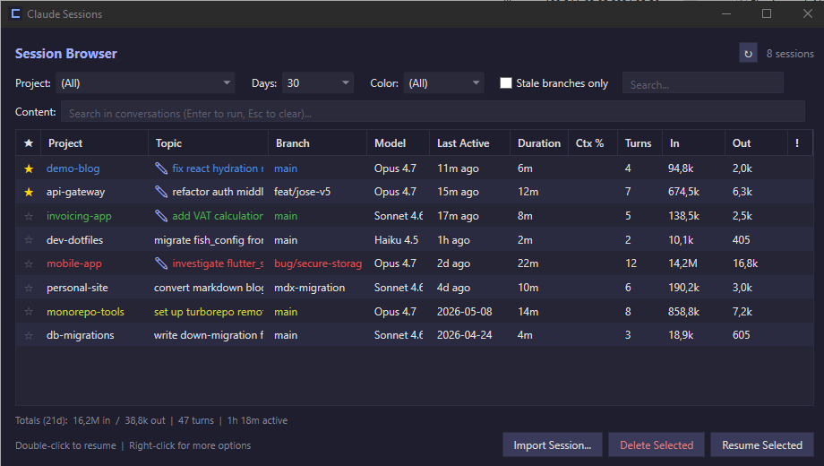
</p>

Claude Code's CLI is great at writing code; it's less great at telling you how much of your 5-hour block is left, where you parked that one session from last Tuesday, or which `/model` your latest project actually uses. Sidekick is a tray-resident companion that fills those gaps — a persistent usage view, a searchable browser for every session you've ever had, per-session notes and color tags, project quick launchers with global hotkeys, and a prompt library.

Native WPF — single self-contained binary, ~50 MB RAM idle. No Electron, no background services, no telemetry.

**Status:** v1.0.0 — first public release. Tested on Windows 10/11 with .NET 10 runtime.

> **Note:** This is a hobby project built using [vibe coding](https://en.wikipedia.org/wiki/Vibe_coding) with Claude Code — most of the source is AI-assisted. It's been dogfooded by the author for a few months on real workloads, but please treat it as a useful utility rather than production-grade software. Bug reports liberally welcomed via [GitHub Issues](https://github.com/RafalZG/claude-sessions-sidekick/issues).

## What it does

### Live usage tracking
- 5-hour rolling block + weekly Sonnet/Opus utilization in your tray
- Optional `/compact` recommendations when context gets tight
- Auto-refresh on Claude Code OAuth token rotation
- Multiple view modes: Mini, Compact, Full

### Session browser
- All sessions across all projects in one list
- Full-text search inside session JSONL contents (filters out tool results, thinking signatures)
- Per-session free-text **notes** (right-click → Edit Note)
- Per-session **topic override** (right-click → Rename Topic) when the auto-derived topic isn't recognizable
- Per-session **color tags** for visual grouping
- **Favorites** with greyed star ☆ for unflagged
- Persistent column widths/order + window size — right-click header to restore defaults
- Quick "Resume" launches `claude --resume {sessionId}` in your shell of choice
- Hover the **In** column to see the breakdown of fresh input vs. cache reads vs. cache writes — the headline number is dominated by cache reads, which bill at roughly 1/10 the rate

<p align="center">
  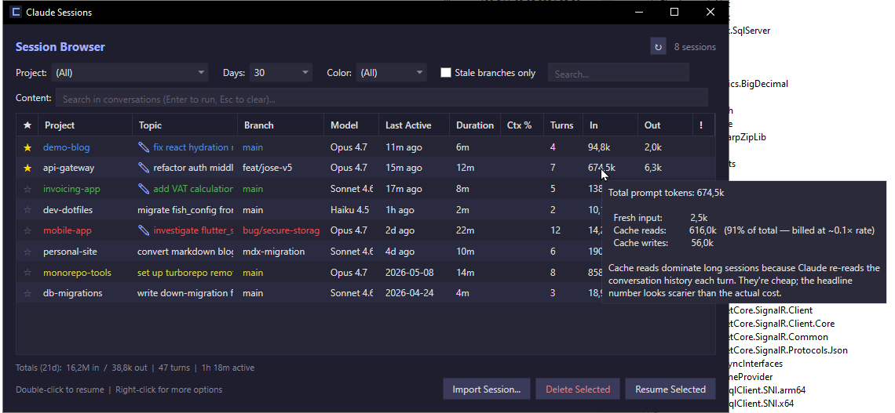
</p>

### Quick launchers
- Per-project entries with global hotkeys (low-level keyboard hook — works even when Claude Code isn't focused)
- Optional `--continue` (resume last session) per entry
- Per-entry shell override: CMD / PowerShell / Git Bash / Auto-detect
- Per-entry **model override** (Sonnet 1M / Opus 1M / Haiku 200k) — forces `--model X` on every launch, overrides whatever the project's last `/model` choice would otherwise produce

<p align="center">
  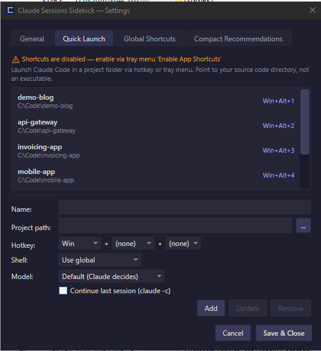
</p>

### Permission helper
- Watches Claude Code permission additions; suggests generalizing overly-narrow rules (e.g. `cd /specific/path && grep ...` → broader pattern) — opt-in

### Prompt library
- Stash reusable prompts; one-click "Send to Claude" (clipboard + launch)

### Claude config + MCP browser
- View detected Claude Code installation, model defaults, MCP servers per project
- Block/install MCP servers across projects

## Working with saved sessions

The session list is meant to be a **journal** — a searchable, color-coded record of past Claude Code work — not a place to live in one ever-growing conversation. Notes, color tags, and favorites are here so you can recognize a session and decide what to do *next*; they're not arguments for keeping a 500-turn session alive forever.

### When to resume, compact, or start fresh

| Situation | Action |
|---|---|
| Same task, picking up within ~a day | **Resume** (double-click the session) |
| Sessions started on an older model line you want to migrate forward | **Resume with model →** (right-click a row) — picks the alias for that one launch |
| Same task, but the session feels bloated or `/compact` warnings are firing | **`/compact`** inside the session, then keep going |
| New task or new problem | **Start fresh** — don't pay for last week's context every turn |
| Long-running project spanning weeks | Periodic `/compact` + a short "status: done X, next Y" snapshot at the top of each new session |

### Why long sessions aren't free

- **Cache TTL is ~5 minutes.** A session you come back to hours later pays full input on the next turn regardless of how active it was earlier — there's no "warm session" benefit.
- **Every turn re-processes the full history.** A 100k-token session pays for 100k input on every reply, even for a one-line fix.
- **Compact ≠ free.** Compacting trims to ~5–20k of summary; baseline per turn drops from ~100k+ to ~10–30k. Fresh starts at ~5–10k. On Opus that's roughly $0.05–0.10 per turn difference between compacted-vs-fresh, and an order of magnitude between bloated-vs-compacted.

The session browser exists so you can quickly find the right anchor for *new* work — scroll, recognize "ah, that's the migration thread from two weeks ago", grab the context you need (or just remind yourself of the next step), and then either resume briefly or open a fresh session with a one-line status snapshot. That's the workflow notes / colors / favorites are designed for.

## Requirements

- Windows 10 (build 19041 / May 2020 Update) or newer / Windows 11
- [.NET 10 Desktop Runtime](https://dotnet.microsoft.com/download/dotnet/10.0)
- [Claude Code CLI](https://docs.claude.com/claude-code) installed and signed in

## Install

Three install paths, pick the one that suits your environment:

### Via winget (recommended for personal install)

```powershell
winget install RafalZG.ClaudeSessionsSidekick
```

Installs silently to `%LocalAppData%\ClaudeSessionsSidekick\`. No SmartScreen prompt — winget verifies the installer hash against its manifest and runs the install in the context of the Microsoft-signed `winget.exe`.

> Pending acceptance into the public winget catalog. Until then, install from the in-repo manifest: `winget install --manifest winget/1.0.0` after cloning. See [winget/README.md](winget/README.md).

### Direct download from GitHub

1. Download `ClaudeSessionsSidekick-win-Setup.exe` from [Releases](https://github.com/RafalZG/claude-sessions-sidekick/releases)
2. Run it. On first launch you may see a Windows SmartScreen warning ("Windows protected your PC") — click **More info** → **Run anyway**. This is expected for unsigned OSS; see [Code signing policy](#code-signing-policy) below for the plan.
3. The app lives in your tray. Right-click → Settings → Quick Launch to add your projects.

### Via Intune / Company Portal (corporate deployment)

For IT admins pushing the app to managed devices via Microsoft Intune:

| Field | Value |
|---|---|
| Install command | `ClaudeSessionsSidekick-win-Setup.exe --silent` |
| Uninstall command | Read `UninstallString` from `HKCU\Software\Microsoft\Windows\CurrentVersion\Uninstall\ClaudeSessionsSidekick` (registered by the installer) |
| Detection rule | File exists: `%LocalAppData%\ClaudeSessionsSidekick\current\ClaudeSessionsSidekick.exe` |
| Install context | User |
| Architecture | x64 |

Per-user install, no admin elevation required. Intune deployment bypasses SmartScreen entirely because the install runs through the Intune Management Extension, which is trusted by the managed device's policy.

## Updates

The app checks for a new version on startup and shows a tray balloon when one is available. To install: right-click the tray icon → **Check for updates…**. The download + swap + restart is handled automatically (powered by [Velopack](https://github.com/velopack/velopack)).

## Uninstall

1. Right-click the tray icon → **Exit**
2. Open Windows **Settings → Apps → Installed apps**, find **Claude Sessions Sidekick**, click **Uninstall**

This removes the application binary and the auto-update infrastructure under `%LocalAppData%\ClaudeSessionsSidekick\`. Your user data (settings, favorites, color tags, notes, prompt library) lives separately under `%APPDATA%\ClaudeSessionsSidekick\` and is **not** removed by uninstall — so you can reinstall later without losing your customizations. For a fully clean removal, delete that folder manually after uninstall.

## Build from source

Requires .NET 10 SDK + Windows.

```powershell
git clone https://github.com/RafalZG/claude-sessions-sidekick.git
cd claude-sessions-sidekick
dotnet build ClaudeSessionsSidekick.sln
dotnet test ClaudeSessionsSidekick.sln
dotnet run --project ClaudeSessionsSidekick.csproj
```

## Where data is stored

`%APPDATA%\ClaudeSessionsSidekick\`:
- `settings.json` — hotkeys, quick-launch entries, view preferences
- `favorites.json` — starred sessions
- `session-colors.json` — color tags
- `session-notes.json` — free-text notes per session
- `session-browser-layout.json` — column widths, window size
- `prompts.json` — prompt library
- `logs\` — recent app logs

## FAQ

**Q: Does this read my Claude Code conversations?**
Yes — it parses session JSONL files in `%USERPROFILE%\.claude\projects\` for the browser/search features. Everything stays on your machine; nothing is sent anywhere.

**Q: Why "Sidekick"?**
The tool is a sidekick *to* Claude Code, not a replacement — it adds tray-resident utilities and a session navigator that the CLI itself doesn't provide.

**Q: Will this work on macOS / Linux?**
No — WPF is Windows-only. A cross-platform port would need a rewrite.

**Q: Does this use Anthropic's API or my Claude Code subscription?**
The widget piggybacks on your local Claude Code installation. It reads the same OAuth token Claude Code uses for the usage limits API, and never makes any other API calls.

## Contributing

PRs welcome.

## Security & Privacy

Security issues: please report privately via [GitHub Security Advisories](https://github.com/RafalZG/claude-sessions-sidekick/security/advisories/new). See [SECURITY.md](SECURITY.md).

Privacy: the app does not transmit any data to the author or any third party. The only outbound network call is to Anthropic's official Claude Code usage API using your own OAuth token. See [PRIVACY.md](PRIVACY.md) for full details.

## Code signing policy

**Current status (May 2026):** The Windows binary is **unsigned**. An application to the [SignPath Foundation](https://signpath.org/) OSS program was declined as of 2026-05-21 — the project is too fresh for their public-visibility threshold. A re-application is planned once community adoption accumulates. In the meantime, the recommended install paths above (winget, Intune) bypass SmartScreen friction for almost every user; direct-download from GitHub Releases shows a one-time "Run anyway" prompt.

When code signing eventually lands, this is the policy it will follow:

Free code signing on Windows is provided by [SignPath.io](https://about.signpath.io/), certificate by the [SignPath Foundation](https://signpath.org/).

### Roles

- Committer / Reviewer / Approver: Rafał Zygmunt ([@RafalZG](https://github.com/RafalZG))

All source changes are made through this public repository. Releases are built from source by GitHub Actions (see [`.github/workflows/release.yml`](.github/workflows/release.yml)) and published as GitHub Releases. The signing step runs server-side at SignPath on the built artifact — the certificate's private key never leaves SignPath infrastructure and is not accessible to the project author.

### Privacy

See [PRIVACY.md](PRIVACY.md). Claude Sessions Sidekick does not transmit user data to the project author. The only outbound network calls are to Anthropic's Claude Code usage API (using the user's own OAuth token) and to GitHub Releases for update checks and downloads.

## More screenshots

<details>
<summary>Tray view modes (Mini / Compact / Full)</summary>

The widget cycles between three sizes via the tray menu. Mini is a slim
pill showing just the two utilization percentages; Compact adds the
progress bars; Full adds the per-session breakdown.

<p align="center">
  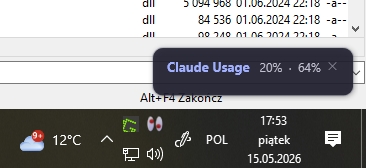
  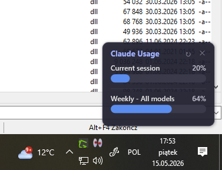
  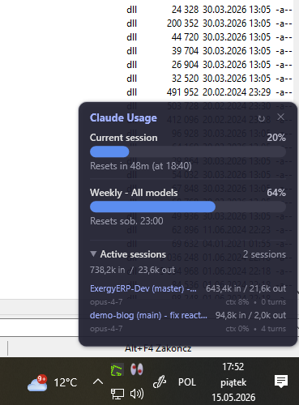
</p>

</details>

<details>
<summary>Settings tabs</summary>

<p align="center">
  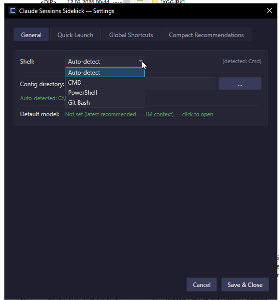
  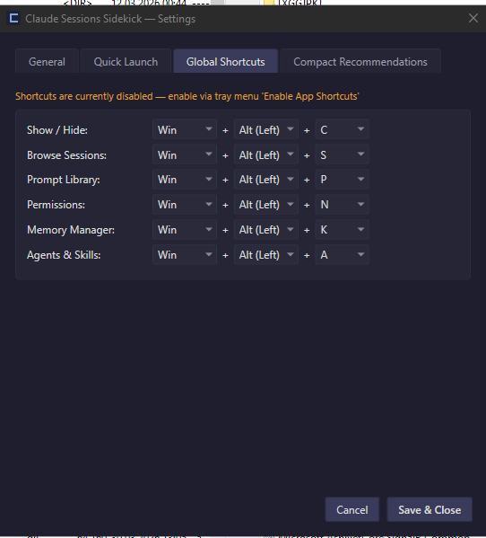
  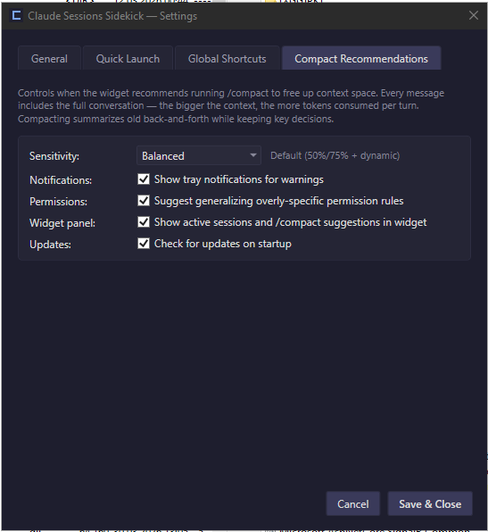
</p>

</details>

<details>
<summary>Permission Manager, Memory Manager, Agents &amp; Skills, Prompt Library</summary>

<p align="center">
  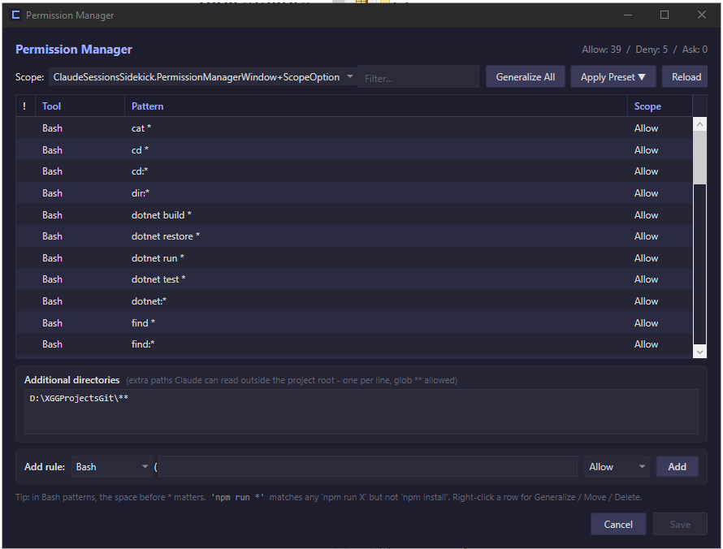
</p>

<p align="center">
  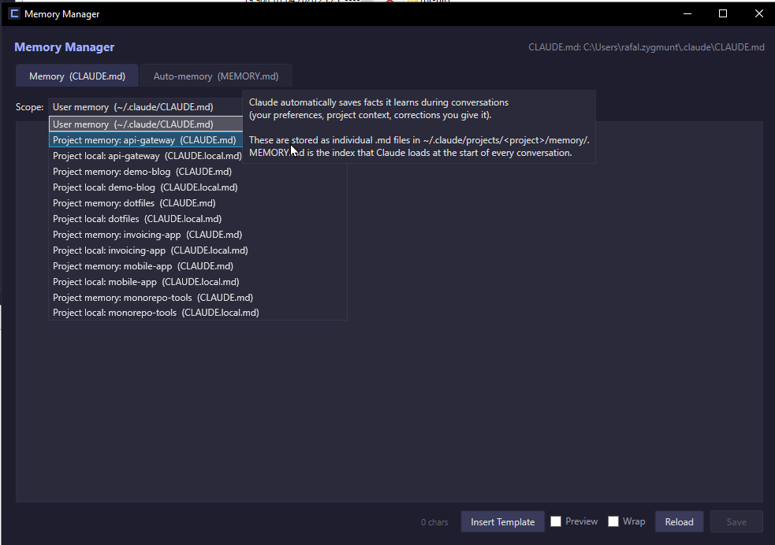
</p>

<p align="center">
  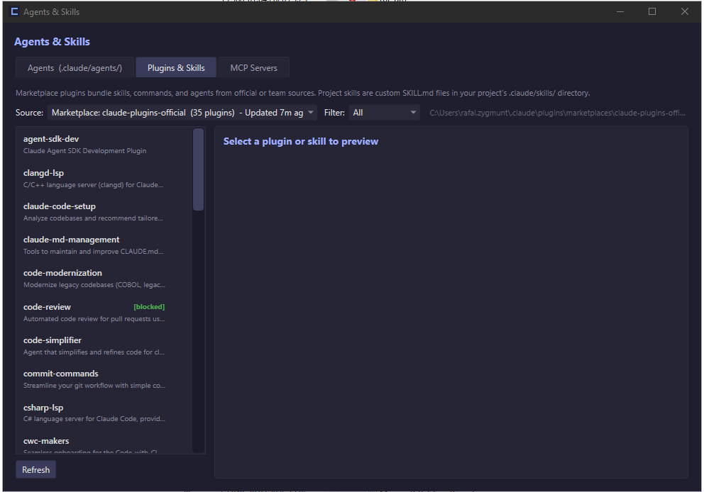
</p>

<p align="center">
  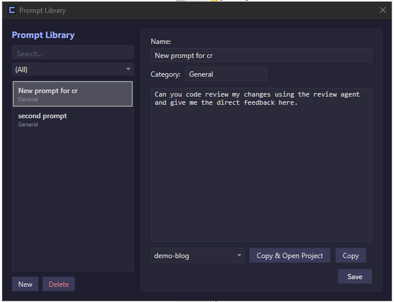
</p>

</details>

## License

[MIT](LICENSE) — © 2026 Rafał Zygmunt
